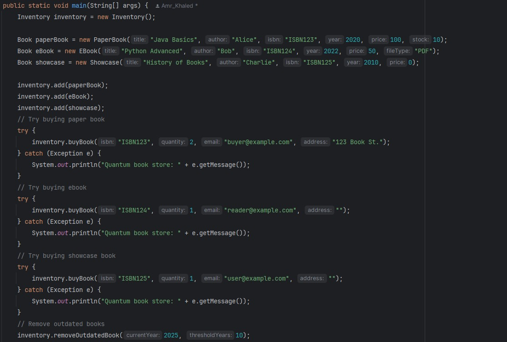
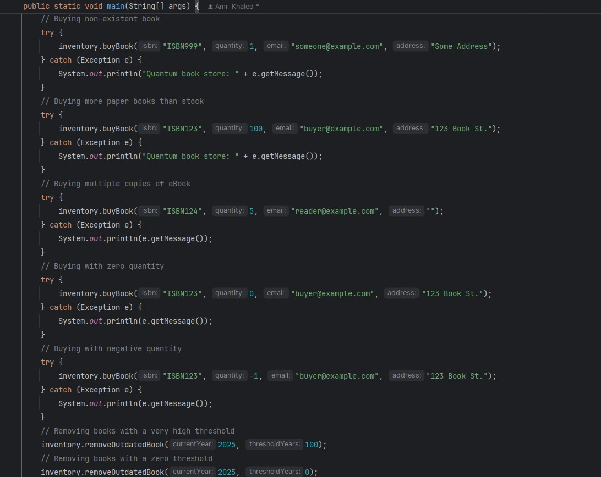
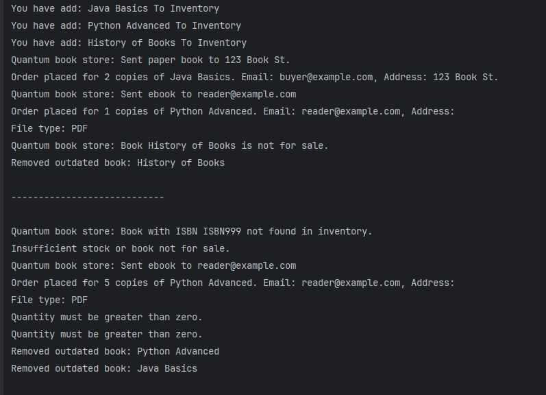

# 📚 Quantum Bookstore System

A simple object-oriented Java console application simulating an extensible online bookstore with paper books, eBooks, and showcase items.  
This project was built as part of the **Fawry N² Dev Slope #10 Challenge**.

---

## 🛠️ Features

- Add different types of books to an inventory:
  - 📘 **PaperBook** (can be shipped, has stock)
  - 📱 **EBook** (can be emailed, has file type)
  - 🖼️ **ShowcaseBook** (not for sale)
- Buy books using:
  - ISBN
  - Quantity
  - Email
  - Shipping address
- Remove outdated books based on publishing year and threshold
- Extensible and clean OOP design

---

## 📁 Project Structure

```
src/
├── Book.java
├── PaperBook.java
├── EBook.java
├── Showcase.java
├── Inventory.java
├── ShippingService.java
├── MailService.java
└── Main.java
```

---

## 🧪 Sample Test Cases

```plaintext
✅ Buy 2 paper books
✅ Buy 1 eBook
❌ Try to buy showcase book
❌ Try to buy more paper books than stock
❌ Try to buy multiple eBooks
❌ Try to buy with 0 or negative quantity
❌ Try to buy non-existent ISBN
✅ Remove outdated books
```

---

## 🖼️ Screenshots

### Normal Test Cases


### Testing Edge Cases


### Expected Output


### Project Structure


---

## 🚀 How to Run

1. Clone the repo or download the source code
2. Open the project in IntelliJ IDEA or any Java IDE
3. Run `Main.java`
4. Observe the console output

---

## ⚙️ Requirements

- Java 8 or higher (tested on Java 21)
- Any IDE that supports Java (IntelliJ IDEA recommended)

---

## 📌 Notes

- Shipping and Mail services are mocked via static classes
- Code is fully extensible — just subclass `Book` to add new book types
